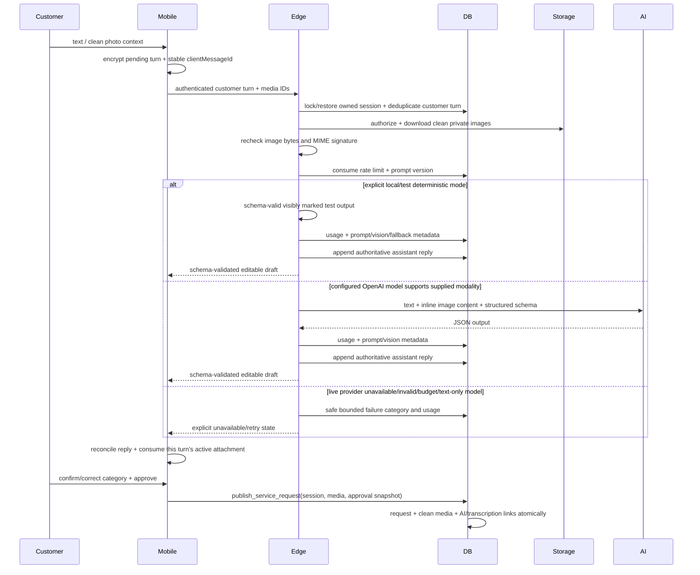

# AI architecture

The mobile client sends bounded customer turns to the authenticated `ai-diagnostic` Edge Function.
The server ignores client-authored assistant messages as authority, restores the ordered server history,
and persists each authoritative assistant reply under an owned `ai_session`. Stable
`clientMessageId` values make customer turns replay-safe. The client encrypts the active draft,
pending turns, temporary fallback messages, and media bindings locally; after reconnect or restart it
restores the server session, replays missing customer turns sequentially, and reconciles temporary
messages with server replies without duplicating turns.

Selected image and voice files are copied immediately from picker/cache locations into a
user-scoped app-private directory. The encrypted snapshot stores stable local media IDs and keeps
their association with one exact customer turn across restart. Active composer attachments are
separate from turn-owned and request-level media. Queuing a turn transfers its active media bindings
to that turn and clears the composer, so a following text turn cannot inherit an old voice recording
or transcript. Replacing an active attachment never deletes an object already owned by a pending
turn, and multiple pending offline turns retain distinct objects. The queue permits four retained
items, 10 MiB per item, 20 MiB total, and seven days of retention. Replay uploads and scans every
queued file before submitting its bound turn. Voice replay atomically claims the
`userId`/`clientMessageId` transcription job, uploads/scans, transcribes, persists the transcript,
and only then sends that authoritative transcript to the diagnostic assistant. Simultaneous callers,
timeouts, and restart cannot invoke the external transcription provider twice during the bounded
15-minute claim lease. A hard-crash lease becomes reclaimable rather than blocking the turn forever,
and its ownership token prevents a stale worker from overwriting the retry. Failure releases the
claim and leaves the voice turn queued with an explicit in-session retry
path; it never replays a generic recording label. Successful atomic publication binds the final
transcription jobs and separately retained request attachments, then deletes the snapshot and local
files.
Offline explicit draft deletion removes local state/media immediately and queues server-session
abandonment for the next connection. Replacing retained media deletes the superseded object and index
entry.

For clean `request_media` images, the function verifies ownership/status, downloads the private
object server-side, rechecks the byte limit and detected MIME signature, and passes base64 image
content through a provider-neutral multimodal contract. Private storage URLs and quarantine objects
never enter the provider request. The OpenAI adapter uses Responses API `input_image` content, has
an explicit vision-capability switch, uses `gpt-5.6-terra`, requests a strict structured response
with `store: false`, and keeps credentials server-only. At most four images, 10 MiB each and 20 MiB
total, are accepted. A selected text-only model rejects an image turn rather than silently dropping
the image or fabricating a text-only live result.

## OpenAI execution boundary

Diagnostic, transcription, and provider-brief translation share one bounded server runtime. The
OpenAI SDK performs no hidden retries; the application permits at most two attempts inside one
overall deadline and retries only a timeout, rate limit, or provider 5xx response. Raw provider
errors, prompts, responses, transcripts, and private media are never operational metadata. Logs and
usage events contain only operation, safe category, attempts, latency, correlation identifier, and
bounded usage counts. Exhausted quota and billing errors are terminal and are not retried.

Content-free operational telemetry is separate from private business records. The diagnostic
endpoint currently writes the original user text into both `ai_messages.original_content` and
`ai_messages.redacted_content`; the latter field does not apply redaction. Prompts, transcripts,
diagnostic output, translations, and customer edits stored for the product remain content-bearing
data subject to the applicable access, retention, deletion, and privacy review requirements.

| Operation                  | Model            | Deadline | Attempts  | Response bound                   |
| -------------------------- | ---------------- | -------- | --------- | -------------------------------- |
| Diagnostic                 | `gpt-5.6-terra`  | 30 s     | At most 2 | 1,200 output tokens              |
| Provider brief translation | `gpt-5.6-luna`   | 20 s     | At most 2 | 800 output tokens                |
| Audio transcription        | `gpt-transcribe` | 45 s     | At most 2 | 8,000 validated transcript chars |

The audio transcription endpoint has no output-token cap parameter, so the server enforces the
character bound after receipt. The OpenAI credential is read only by Edge Functions. It is never
returned to mobile/web clients, embedded in EAS/Next public configuration, or supplied to the media
scanner.

`confirmedCategorySlug` and `summaryRequested` are explicit prompt inputs, not metadata-only hints.
The active database prompt declaration and diagnostic metadata use `diagnostic-v4`. Its strict
schema includes up to four localized `quickReplies` bound to the current first follow-up question;
the explicit local/test deterministic adapter uses the same contextual contract, and the mobile
client always keeps free text available. AI never
publishes, quotes a guaranteed price, diagnoses with certainty, or replaces emergency guidance.
The UI keeps suggested, selected, and customer-confirmed category state separate. The initial AI
suggestion is null; only an authoritative diagnostic can populate it. Selection records `manual`,
`ai_suggestion`, or `customer_correction` truthfully and survives restart. Publishing requires a
separate customer-owned command with explicit category confirmation
and approval. The transaction creates the request, binds clean request media, links diagnostics and
applicable transcriptions, records the approval snapshot, and marks the owned active session
published. The Edge deterministic provider requires an explicit local/test selection. In Preview and
production, invalid provider output, provider failure, network interruption, and unsupported vision
produce an explicit Edge failure. Separately, the mobile client can create a visibly temporary
deterministic advisory draft after eligible failed or offline processing in any environment. Consent
denials, transcripts awaiting review, and incomplete voice transcription follow their own blocking or
retry paths. Temporary drafts are marked as fallback output, reconciled with later server replies,
and remain subject to customer review and approval. The client retains the editable/manual intake
and retry path. Safety flags show conservative immediate
guidance and escalate to manual review. Original content, translations, customer edits, media
bindings, and provider-generated output remain separate.

## Voice transcription

`transcribe` accepts only customer-owned, scanner-clean, sanitized M4A audio from the fixed private
request-media bucket. The Edge Function revalidates the ledger, MIME type, size, stored object type,
and ownership before sending bytes to the server-only OpenAI adapter. `gpt-transcribe` runs within a
45-second overall deadline and at most two attempts. The transcript is required to be non-empty and
at most 8,000 characters, remains editable by the customer, and is never logged with the audio or
provider response.

The existing atomic claim binds user, client message, private audio path, and claim token. A cached
completion does not call OpenAI again; a failed claim releases for an explicit retry, while a stale
worker cannot overwrite a later result. Missing configuration or provider failure is reported as a
safe unavailable state and leaves the customer flow recoverable. It does not substitute a generic or
fabricated transcript.

The diagnostic Edge boundary does not trust the mobile review state. Before a voice turn can be
persisted or sent for diagnosis, it requires exactly one clean audio upload and an unpublished,
completed transcription row matching the authenticated customer, private audio path, client message
identifier, and exact customer-confirmed transcript. Missing or mismatched confirmation fails closed;
text/image turns cannot smuggle a request-audio upload into the diagnostic path.

## Provider brief translation

`translate-provider-brief` authorizes the current provider against an unexpired match and derives the
target locale from that provider profile. Source and target locale inputs are restricted to Arabic,
English, Urdu, and Hindi. The live adapter uses OpenAI Responses with `gpt-5.6-luna`, `store: false`,
a strict schema for the returned text fields, a 20-second overall deadline, at most two attempts,
and an 800-output-token cap. The prompt requests the target language and treats user text as
untrusted data.

The original brief is always returned and displayed. Validation requires exact copies of the source
category and city names and inclusion of extracted protected tokens, including numbers, in the
corresponding translated fields. Category/city identifiers, district identifier, urgency, requested
time, timing mode, and request version are copied from authoritative data and cannot be
translation-authored. There is no returned-language classifier or general semantic-equivalence
check; structurally valid text in the wrong language or with altered meaning can pass these checks.
Invalid JSON, invalid output fields, a protected-token or immutable-name mismatch, or provider
failure discards the candidate translation. The request then records an explicit failed state with
the unchanged original instead of silently substituting deterministic output.

Results and failures store the source hash, locale pair, provider/model/prompt version, attempts,
safe error category, bounded usage, and status. A cache entry is reused only for the same source and
provider/model/prompt identity. The deterministic adapter remains visibly marked and local/test-only.
Preview and production OpenAI translation remain **HUMAN INPUT REQUIRED** until the account owner and
AI/legal/privacy owners approve credentials, model/quota access, payload, DPA, region, retention, and
customer/provider notices. Repository implementation alone is not live activation evidence.

## Category-first customer intake

The customer chooses and confirms the broad category before the AI conversation. The optional
subcategory is persisted with the encrypted intake snapshot and every queued turn. Both confirmed
slugs cross the Edge Function schema and are included in the server prompt as trusted application
context outside the untrusted complaint envelope. This prevents the assistant from needlessly
rediscovering the selected service while preserving its ability to recommend a correction.

Camera, gallery and voice remain turn-scoped. Offline replay preserves `clientMessageId`, media
bindings and category/subcategory context. AI completion only makes a best-available structured
summary available for review; it never publishes a request. Location, timing, customer edits and
explicit approval are separate focused states, and publication continues through the durable
idempotent mutation journal. The authoritative message timeline scrolls independently while the
shared composer remains fixed above the keyboard and safe area. Delivery, offline and retry status
is rendered on the exact customer message rather than as an unrelated global banner.
