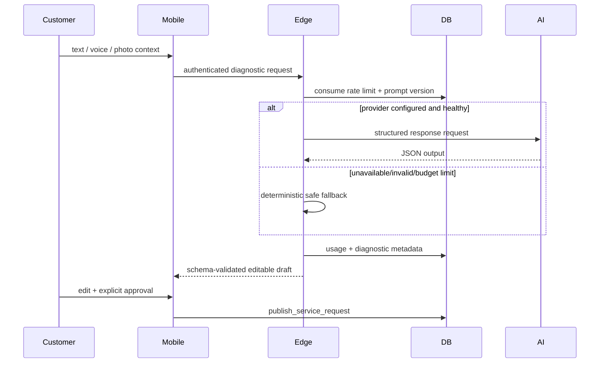

# AI architecture

The mobile client sends a bounded conversation to the authenticated `ai-diagnostic` Edge Function. The function rate-limits, redacts/logs metadata only, calls the configured provider through a provider-neutral interface, requests JSON Schema output, validates it, and records provider/model/prompt/latency/usage/fallback metadata. OpenAI is implemented with the Responses API; production keys remain server-side.

AI never publishes, quotes a guaranteed price, diagnoses with certainty, or replaces emergency guidance. Safety flags show immediate conservative instructions and escalate to manual review. Original content, translations, and customer-approved edits remain separate.

## Provider brief translation

`translate-provider-brief` authorizes the current provider against an unexpired match and derives the target locale from that provider profile. It translates only local test data today: the deterministic adapter is visibly marked and disabled in production. The original brief is always shown; category/city identifiers, urgency, requested time, and request version are copied from the source after translation and cannot be translation-authored. Results and failures are stored with a content hash, locale pair, adapter version, and status. Connecting any external translation processor is intentionally blocked until the data-processing terms, payload fields, retention, region, and customer/provider notices receive human approval.
