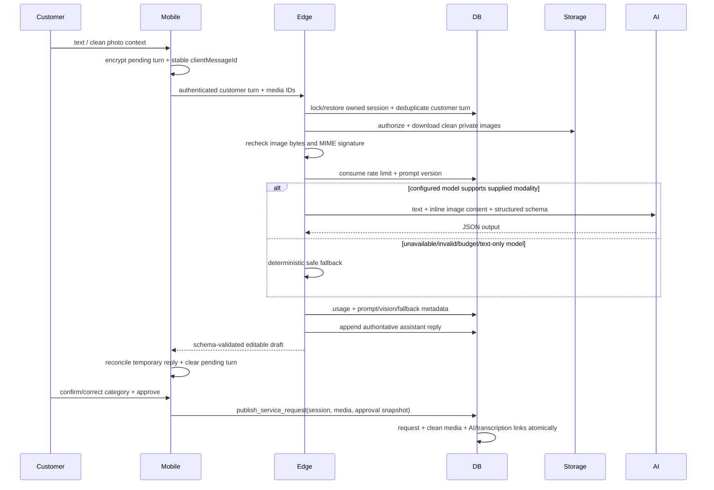

# AI architecture

The mobile client sends bounded customer turns to the authenticated `ai-diagnostic` Edge Function.
The server ignores client-authored assistant messages as authority, restores the ordered server history,
and persists each authoritative assistant reply under an owned `ai_session`. Stable
`clientMessageId` values make customer turns replay-safe. The client encrypts the active draft,
pending turns, temporary fallback messages, and media bindings locally; after reconnect or restart it
restores the server session, replays missing customer turns sequentially, and reconciles temporary
messages with server replies without duplicating turns.

Selected image and voice files are copied immediately from picker/cache locations into a
user-scoped app-private directory. The encrypted snapshot stores stable local media IDs and keeps
their association with the customer turn across restart. The queue permits four retained items,
10 MiB per item, 20 MiB total, and seven days of retention. Replay uploads and scans every queued
file before submitting its bound turn; upload failure leaves the whole turn pending and never
silently converts it to text-only. Successful atomic publication deletes the snapshot and retained
files. Explicit draft deletion first abandons the owned active server session, then deletes local
conversation state and media; failure leaves the draft recoverable.

For clean `request_media` images, the function verifies ownership/status, downloads the private
object server-side, rechecks the byte limit and detected MIME signature, and passes base64 image
content through a provider-neutral multimodal contract. Private storage URLs and quarantine objects
never enter the provider request. The OpenAI adapter uses Responses API `input_image` content, has
an explicit vision-capability switch, and keeps production credentials server-only. At most four
images, 10 MiB each and 20 MiB total, are accepted. A configured text-only model produces the
deterministic editable fallback instead of silently dropping images.

`confirmedCategorySlug` and `summaryRequested` are explicit prompt inputs, not metadata-only hints.
The active database prompt declaration and diagnostic metadata use `diagnostic-v3`. AI never
publishes, quotes a guaranteed price, diagnoses with certainty, or replaces emergency guidance.
The UI keeps suggested, selected, and customer-confirmed category state separate; no default is
confirmed. Publishing requires a separate customer-owned command with explicit category confirmation
and approval. The transaction creates the request, binds clean request media, links diagnostics and
applicable transcriptions, records the approval snapshot, and marks the owned active session
published. Invalid provider output, provider failure,
network interruption, and unsupported vision produce a schema-validated deterministic fallback that
remains editable and manually publishable. Safety flags show conservative immediate guidance and
escalate to manual review. Original content, translations, customer edits, media bindings, and
provider-generated output remain separate.

## Provider brief translation

`translate-provider-brief` authorizes the current provider against an unexpired match and derives the target locale from that provider profile. It translates only local test data today: the deterministic adapter is visibly marked and disabled in production. The original brief is always shown; category/city identifiers, urgency, requested time, and request version are copied from the source after translation and cannot be translation-authored. Results and failures are stored with a content hash, locale pair, adapter version, and status. Connecting any external translation processor is intentionally blocked until the data-processing terms, payload fields, retention, region, and customer/provider notices receive human approval.
