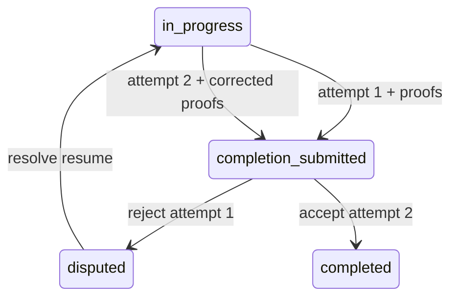

# Completion lifecycle

`completion_attempts` is the authoritative version boundary for submitted work. A job can have many
historical attempts but only one active submitted attempt. `submit_completion` creates the next
attempt under a transaction-scoped advisory lock, binds every clean proof to it, records history and
events, and returns the attempt-scoped proof manifest. A customer decision is unique per attempt,
not per job.

Rejection atomically preserves the reason/evidence and creates one linked dispute, dispute-opened
event, financial hold when applicable, job history/event, provider notification, and operations
queue case. Replaying the same key and payload returns the same decision/dispute; a different payload
raises `IDEMPOTENCY_KEY_CONFLICT`.

Dispute outcome policy:

- `resume` restores `in_progress`, closes the rejected attempt, and does not decrement workload.
- `complete` sets `completed_at` and applies workload and completion metrics exactly once.
- `cancel` and `close_no_further_work` cancel the job transactionally, synchronize the service
  request where applicable, and decrement workload exactly once.

`job_terminal_effects` is the exactly-once marker for terminal workload/metric effects. Every path
preserves job/dispute history, events, notifications, and audit records. Administrative resolution
never creates a customer rating. Mobile evidence loading requests the current attempt manifest, so a
resumed job cannot show stale proofs as the new submission.
