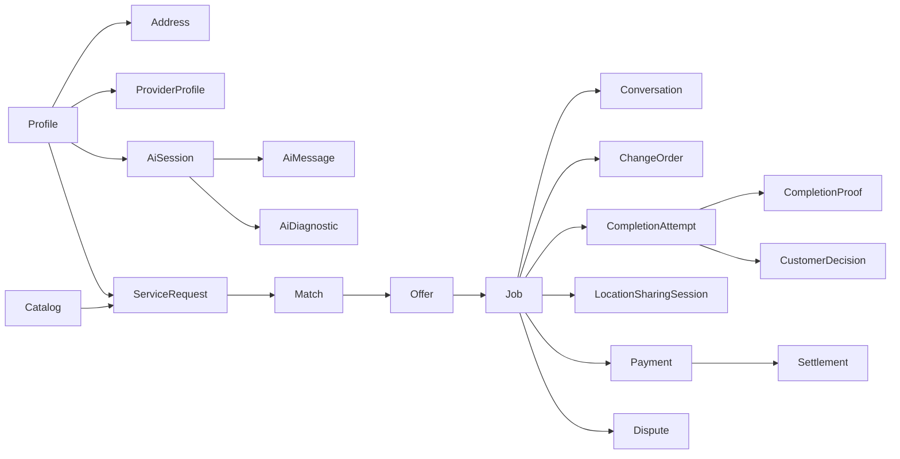
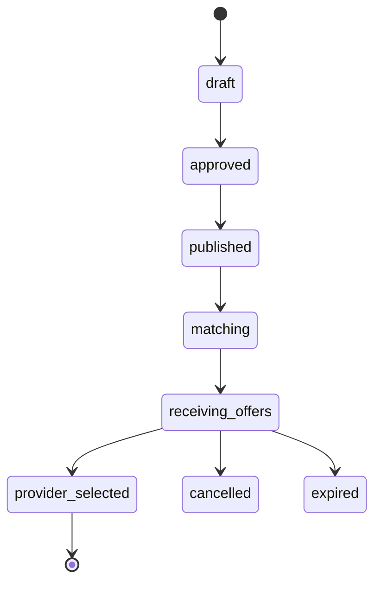

# Data model

The schema is migration-only and uses UUID keys, UTC timestamps, integer SAR minor units, explicit enums/checks/FKs, partial/composite/GiST indexes, version fields, idempotency keys, and append-only sensitive events. Generated TypeScript lives in `packages/database/src/database.types.ts`.





```mermaid
sequenceDiagram
  Customer->>DB: select_offer(offer, idempotency)
  DB->>DB: lock offer + customer request
  DB->>DB: select one; reject competitors
  DB->>DB: create job + assignment + offline payment
  DB->>DB: create conversation members
  DB-->>Customer: job id
```

Exact address records are separate from approximate PostGIS points. Providers match on rounded/approximate geography and cannot read address rows until selected. Offers are row-sealed; customer-safe provider facts come from a whitelisted RPC.

`file_uploads` is the authoritative media lifecycle record. Completion proofs, message attachments, request media, provider documents, and support evidence bind only to a clean upload. The storage path is an internal implementation detail; consumers receive manifests containing upload IDs and ask the signed-media broker for time-limited access.

Refund accounting stores every refund in minor units and derives `partially_refunded` versus `refunded` from cumulative confirmed amounts. Dispute/cancellation commands lock the job and financial rows, enforce expected versions and idempotency payload equality, record workflow history, and defer externally confirmed money movement to a service-role reconciliation command.

Completion is versioned by `completion_attempts`. Proofs and customer decisions belong to one
attempt, one active attempt is allowed per job, and rejected history remains immutable when dispute
resolution resumes work for a corrected attempt. Terminal bookkeeping uses a per-job exactly-once
marker so workload and completion metrics cannot be applied twice.

## Saved customer locations and request snapshots

`addresses.address_kind` separates reusable `saved` addresses from immutable
`request_snapshot` addresses. A user may have at most one active default saved address.
Authenticated owner-only RPCs list, upsert and archive saved addresses. Anonymous callers are
denied.

During `publish_service_request`, the server resolves an optional saved-address identifier under
owner authorization and copies coordinates, normalized address and customer-entered details into
a new request snapshot. Category, optional subcategory, timing mode/window, media and explicit
approval are inserted in the same transaction. A later saved-address edit or archive therefore
cannot move an active or historical job. Existing exact-location policies continue to hide the
snapshot from unmatched providers.
