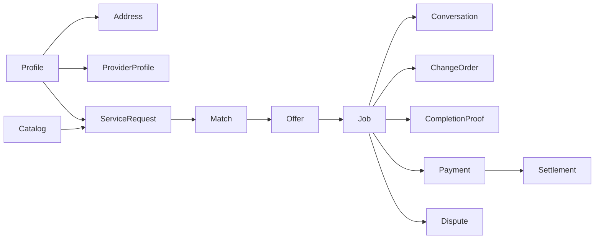
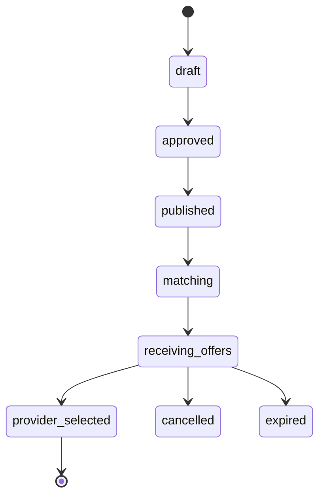

# Data model

The schema is migration-only and uses UUID keys, UTC timestamps, integer SAR minor units, explicit enums/checks/FKs, partial/composite/GiST indexes, version fields, idempotency keys, and append-only sensitive events. Generated TypeScript lives in `packages/database/src/database.types.ts`.





```mermaid
sequenceDiagram
  Customer->>DB: select_offer(offer, idempotency)
  DB->>DB: lock offer + customer request
  DB->>DB: select one; reject competitors
  DB->>DB: create job + assignment + offline payment
  DB->>DB: create conversation members
  DB-->>Customer: job id
```

Exact address records are separate from approximate PostGIS points. Providers match on rounded/approximate geography and cannot read address rows until selected. Offers are row-sealed; customer-safe provider facts come from a whitelisted RPC.
