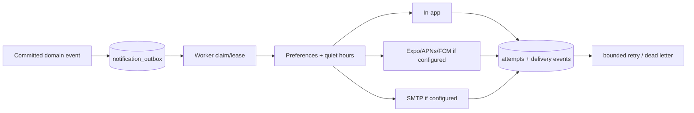

# Notifications

Business transactions insert deduplicated rows into `notification_outbox`. A worker claims pending rows, applies preferences/quiet hours, dispatches configured channels, and appends attempts/delivery results. Missing push/email credentials disable the channel rather than fabricate success.

Provider match, new offer, selection, schedule/state, message, change order, completion, support, and dispute events use deterministic deduplication keys. Push tokens are private, revocable, and removed during deletion processing.
