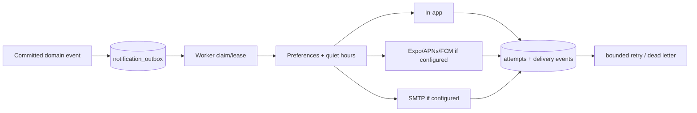

# Notifications

Business transactions insert deduplicated rows into `notification_outbox`. The push worker claims
leased rows, applies preferences, sends a fixed privacy-safe route envelope through Expo, verifies
receipts, and records bounded attempts or dead letters. Missing credentials fail closed rather than
fabricating delivery.

Provider match, new offer, selection, schedule/state, message, change order, completion, support, and
moderation events use deterministic deduplication keys. Payloads contain no message text, address,
document, user identity, or arbitrary URL. Push tokens are AES-256-GCM encrypted, hash-indexed,
limited to ten active installations, rotated atomically, revocable per device or account, and removed
during deletion processing. Notification opens map only to fixed routes and are authorized again
against the current session and role.

Hosted Preview polling uses the one-minute `sallah-notification-worker` pg_cron dispatcher. Its exact
HTTPS Edge URL and dedicated worker secret come from Supabase Vault at invocation time; they are not
stored in the cron command. Missing, malformed, or reused media-cleanup credentials fail closed.
