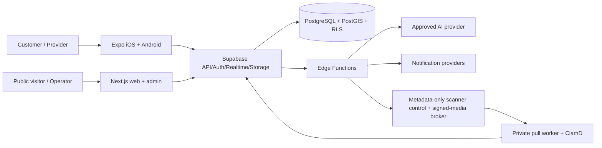
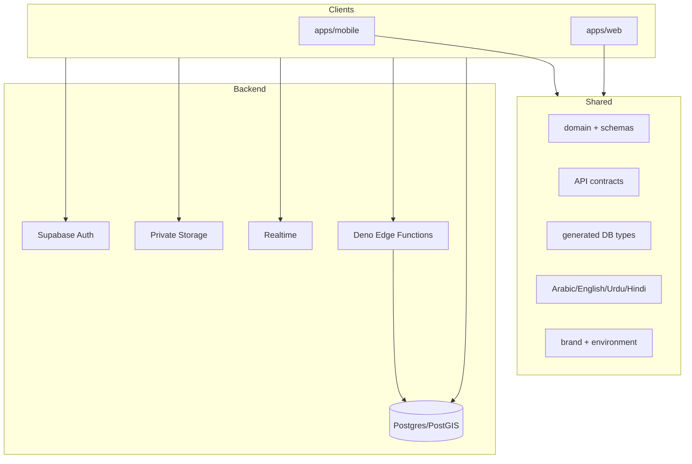

# Architecture overview

SALLAH is a low-operations modular monolith. Expo and Next.js consume shared TypeScript contracts and one Supabase/PostgreSQL authority. Domain commands remain transactional RPCs or authenticated Edge Functions; no client can bypass RLS.

Scale for 20,000 registered users comes from indexed relational queries, capped feeds, PostGIS indexes, outbox workers, private object storage, and stateless clients—not microservices. Costly providers remain feature-gated.

The mobile product restores an authenticated session before entering role-specific route groups. Customer and provider tabs share domain contracts, while role changes are persisted through an authorized RPC and revoked roles disappear on the next context refresh. Native connectivity drives React Query pause/reconnect behavior and a localized offline state.

Private media follows one asynchronous path. An authenticated client obtains a
database-authoritative upload ticket, writes to unreadable quarantine, and asks `scan-upload` to
start or report safe status. That Edge function returns promptly and never downloads, buffers,
hashes, sanitizes, or uploads media bytes. A repository-owned pull worker authenticates to
`scanner-control` with a timestamped one-shot HMAC request, receives one current attempt plus an exact
short-lived signed input capability, and downloads the opaque `scan-input` object directly from
Storage. The worker holds no database, S3, Supabase service-role, publishable, or user credential.

The worker performs an original ClamAV INSTREAM scan, then either full static-image
decode/re-encode/reopen or bounded fixed-argument FFmpeg remux and FFprobe reopen for approved
M4A/MP4 audio and completion MP4 video. It performs a final ClamAV scan and then requests an exact
attempt-bound output capability. After direct upload it uses
an exact signed readback capability to recompute the staged object hash and sends only a bounded,
canonical HMAC attestation. Edge verifies current attempt/deadline, nonce, manifest, type, size, hash,
fresh signature evidence, and exact object metadata. It then performs a server-side Storage copy to
the private final target and transactionally completes the database state. Media bytes never enter
Edge. The existing `media-access` broker independently reauthorizes every protected read; clients
never receive scanner capabilities or broad data credentials.

The metadata-only invariant covers this scanning control plane, not every Edge Function in the
repository. `media-access` remains the live-authorized M1 streaming broker. `ai-diagnostic` and
`transcribe` retain clean-authorized purpose/owner/size checks, but their provider media-transfer and
memory design must be reviewed as an M3 gate before live AI or transcription activation.

ClamAV is malware detection, not CDR. Static JPEG/PNG/WebP images are decoded and re-encoded; animated
or multipage input and metadata-bearing/polyglot output fail closed. Approved M4A/MP4 audio and
completion MP4 video are remuxed without transcoding when their container, codec, stream, duration,
dimension, and size contracts pass. WebM, PDFs, archives, Office files, scripts, executables, and
unknown formats fail closed. Every attempt has distinct opaque input, output, and final-candidate paths, so an old
orphan cannot poison a retry. Response-loss replays reconstruct the authoritative state without a
duplicate scan or promotion. Database-authorized cleanup excludes active attempts and retained clean
finals. A 15-minute scheduled privacy-worker invocation autonomously ages every eligible private
artifact by 24 hours, leases cleanup work, isolates per-item failures, and dead-letters exhausted rows.

The deterministic adapter is explicitly local/test-only. Preview/production require the external
pull-worker control plane over exact HTTPS origins on an operator-proven private network. URL syntax
checks cannot prove that a DNS name is private. The current local topology proves repository behavior,
not hosted capacity, continuous signature updates/ClamD readiness, production egress, alerting, or
runtime-image/legal readiness.
