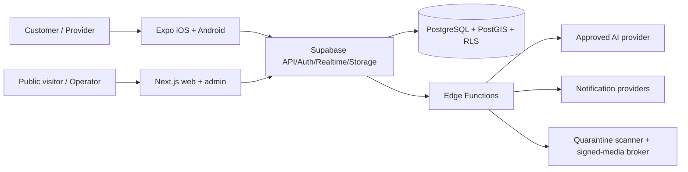
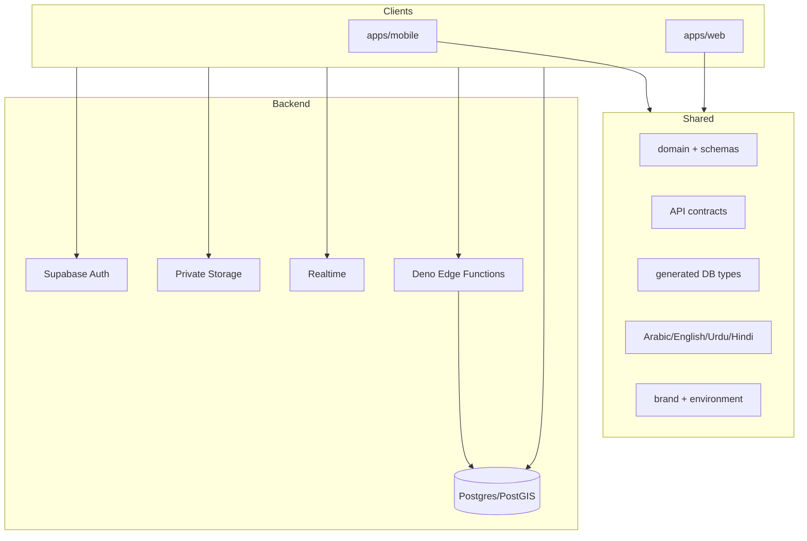

# Architecture overview

SALLAH is a low-operations modular monolith. Expo and Next.js consume shared TypeScript contracts and one Supabase/PostgreSQL authority. Domain commands remain transactional RPCs or authenticated Edge Functions; no client can bypass RLS.

Scale for 20,000 registered users comes from indexed relational queries, capped feeds, PostGIS indexes, outbox workers, private object storage, and stateless clients—not microservices. Costly providers remain feature-gated.

The mobile product restores an authenticated session before entering role-specific route groups. Customer and provider tabs share domain contracts, while role changes are persisted through an authorized RPC and revoked roles disappear on the next context refresh. Native connectivity drives React Query pause/reconnect behavior and a localized offline state.

Private media follows one path: owner upload to an unreadable quarantine bucket, signature and size validation, malware scanning/sanitization, promotion to a private clean bucket, metadata binding to the owning resource, and a short-lived URL issued only by the central `media-access` function after database authorization. Clients never receive a service-role key and cannot list clean buckets directly.
