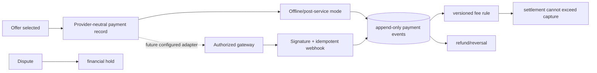

# Payment architecture

The launch-safe default is payment after physical service, represented as an `offline` payment and immutable ledger events. No gateway capture, escrow, payout, VAT/ZATCA, or settlement success is claimed without real configuration and legal/finance approval.

All values are integer minor units. Settlement guards compare gross settlement with captured-minus-refunded events. Payout tables store provider tokens/references only, never raw card or bank credentials.
