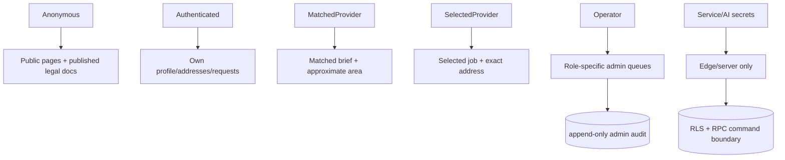
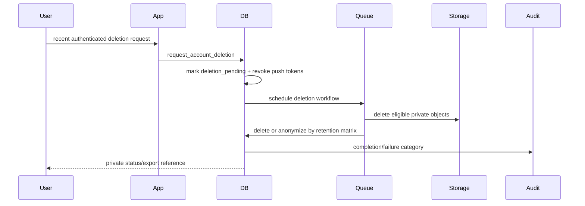

# Security architecture

Controls combine TLS/provider infrastructure, Supabase Auth, RLS, private buckets, owner-prefixed paths, short signed URLs, security-definer functions with fixed search paths, append-only event triggers, structured validation, CSP/security headers, rate limits, audit trails, dependency/secret scans, and cross-role tests. Residual production risks are documented in the threat model.
