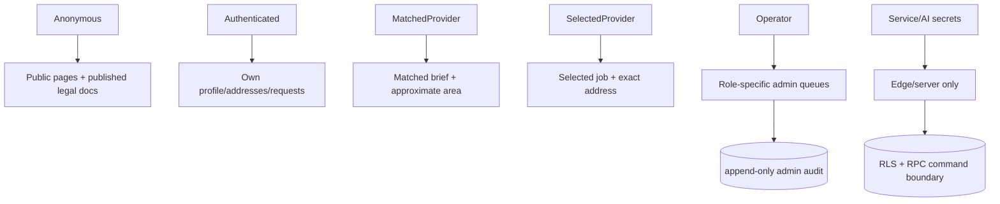
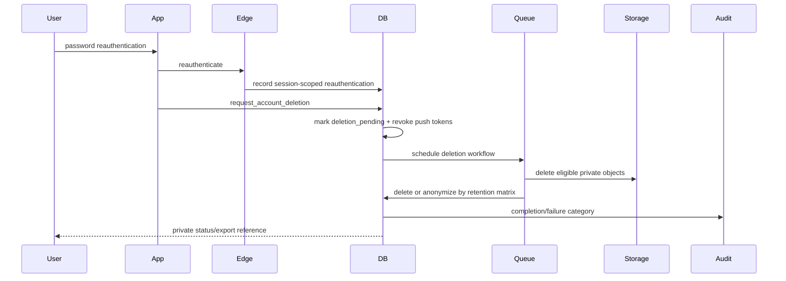

# Security architecture

Controls combine TLS/provider infrastructure, Supabase Auth, RLS, private buckets, owner-prefixed paths, short signed URLs, security-definer functions with fixed search paths, append-only event triggers, structured validation, CSP/security headers, rate limits, audit trails, dependency/secret scans, and cross-role tests. Residual production risks are documented in the threat model.

High-risk privacy commands require a recent server-recorded reauthentication bound to the current Auth session; JWT issue time alone is insufficient. Blocked deletion requests retain a blocker snapshot, notify the account owner, and are reconciled under row locks until blockers clear. The privacy worker paginates storage ownership to exhaustion and cannot mark completion while any owned object remains.

Admin authorization is permission-based and evaluated on every server loader/action against an active profile plus non-revoked role assignments. Aggregate analysts receive no PII, exact-location access is a separate permission, and role revocation takes effect without relying on a stale client claim.

## Database execution boundary

Supabase clients can invoke only exact reviewed RPC signatures. Inherited function execution is
disabled for both exposed and private schemas, while RLS policy helpers are explicitly executable by
`authenticated` only where a policy needs them. Worker, export-coverage, and compatibility
functions remain service-role-only.

The two provider-facing views use `security_invoker=true`. Request briefs continue through request
participant RLS. Public provider profiles are emitted by a fixed-column private projection that
filters to active verified providers; callers receive no raw profile-table privilege.

Unauthenticated external deletion is the only intentionally public mutation RPC. It is
non-enumerating, hash-only, bounded, rate-limited, and audited. A generic invalid-input error contains
no submitted email, while valid and rate-limited requests return the same void contract.
