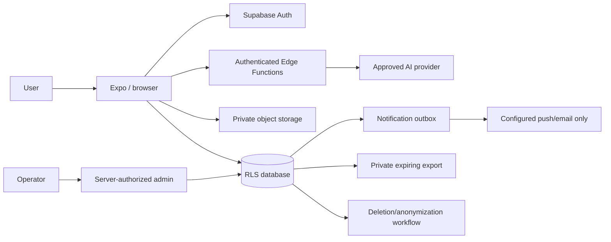

# Data flow

The AI path receives only needed diagnostic content; original data is not overwritten. Exact location bypasses matching/provider briefs and becomes readable only after offer selection. Private objects use owner-prefixed keys and temporary access. Production subprocessors and regional transfer decisions are human/legal inputs.
