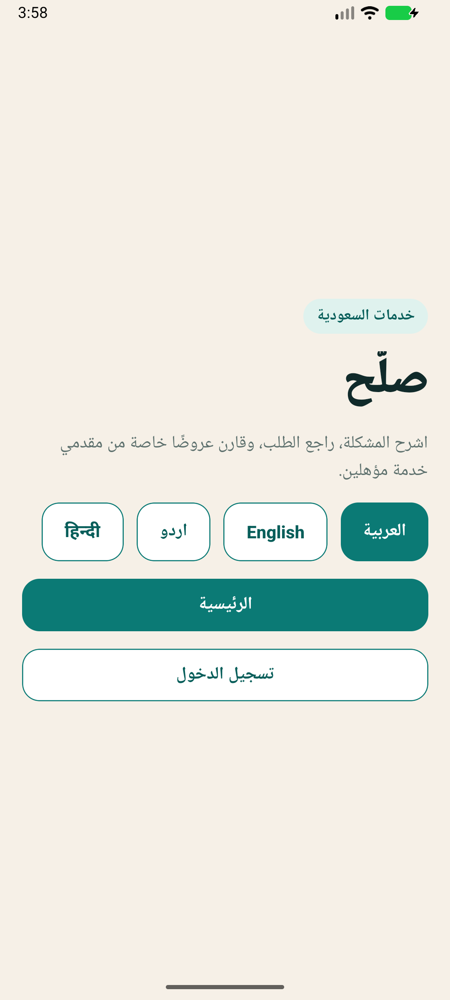
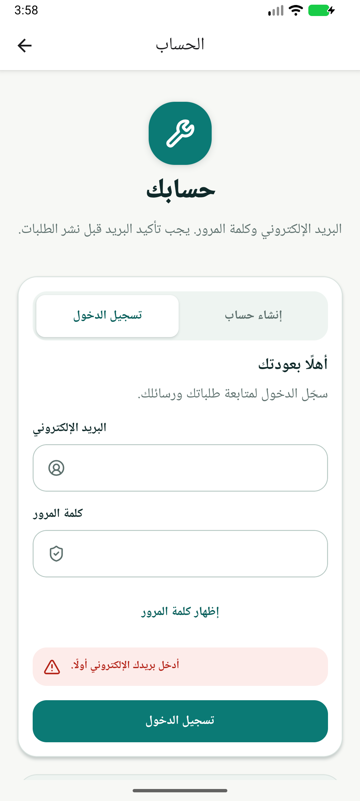
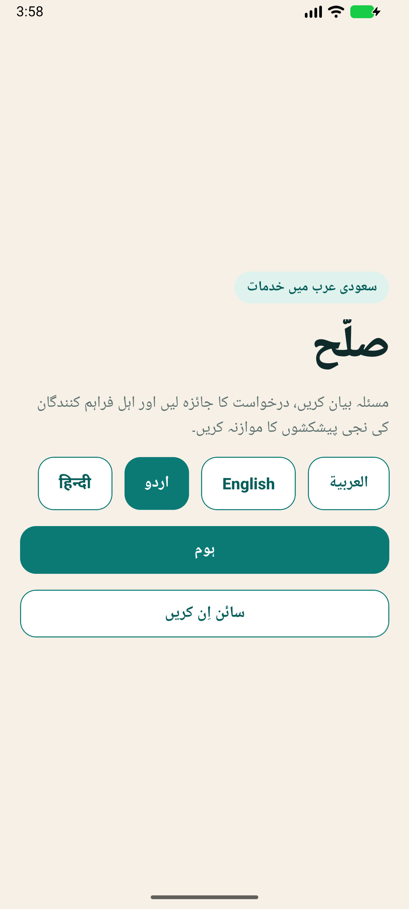
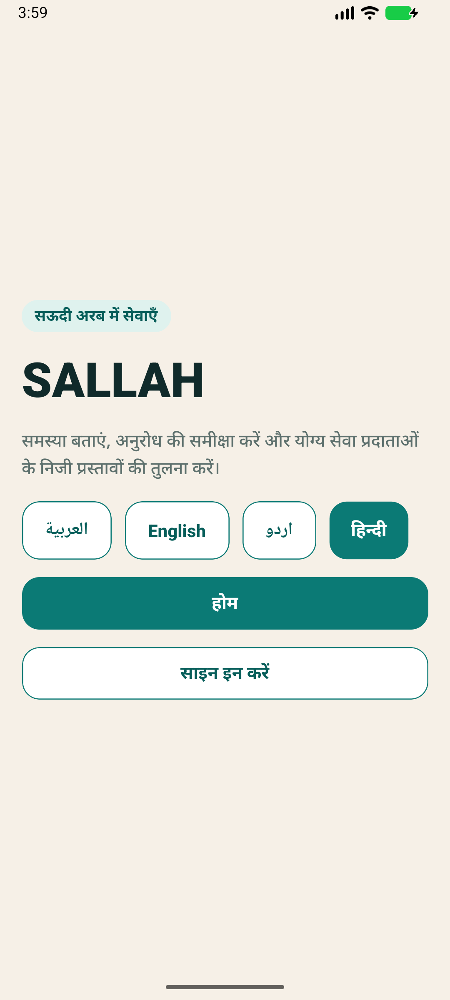
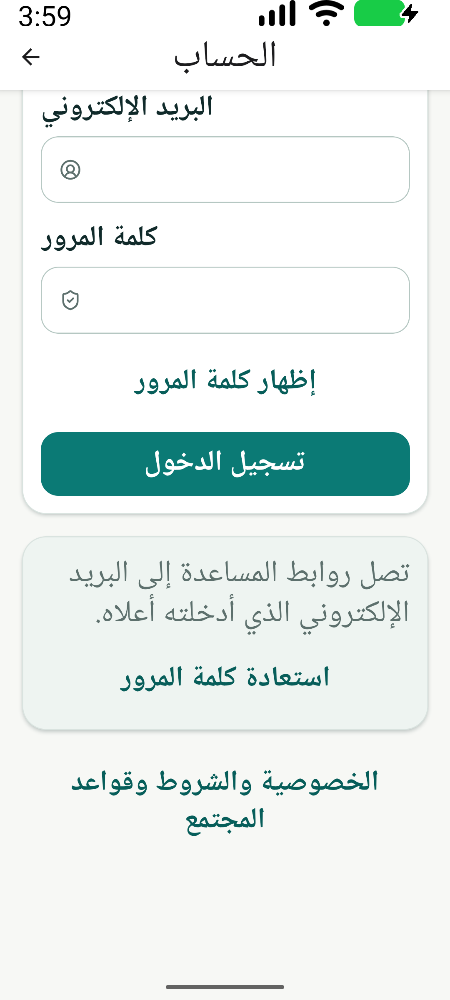
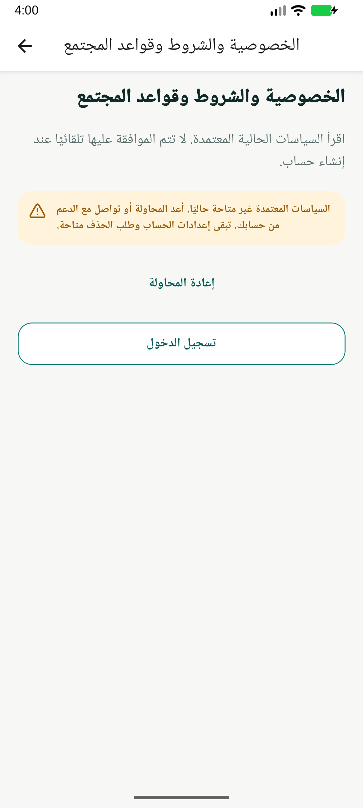

# Android Preview 19 native validation — 2026-09-05

Status: CURRENT SUPPORTING DOCUMENT. Audience: mobile and release reviewers.

The installed Android Preview passed the bounded unauthenticated checks below on an actual Android emulator. This is native APK evidence, not the synthetic browser preview. It does not establish production readiness, successful authentication, or physical-device coverage.

## Immutable build and installation

| Item                        | Observed value                                                                                                                                |
| --------------------------- | --------------------------------------------------------------------------------------------------------------------------------------------- |
| Source commit               | `de2b64813a7e61682d86f3528393d85c0f81dddb`                                                                                                    |
| EAS build                   | [179f33ed-d596-4a3c-95fd-8172ef1362f0](https://expo.dev/accounts/binmuhayas-team/projects/sallah/builds/179f33ed-d596-4a3c-95fd-8172ef1362f0) |
| Profile / platform / status | `preview` / `ANDROID` / `FINISHED`                                                                                                            |
| Build completion            | `2026-09-05T08:53:27.391Z`                                                                                                                    |
| Application / version       | `com.mohmammed0.sallah.preview` / `0.1.0` / versionCode `19`                                                                                  |
| APK SHA-256                 | `98e1520c2ef34737b9472d12fdb5fa113b43c09a7beb7d1d6889c8e81f73b456`                                                                            |
| Signer certificate SHA-256  | `6eac0a42ff2da744747cc9c44f3e1647307879ceb95e9e55dd49c2e15e39367b`                                                                            |
| Signature verification      | PASS: APK Signature Scheme v2; certificate matches the existing Preview signer                                                                |
| Installation                | PASS: `adb install --user 10 -r`, isolated emulator user 10                                                                                   |
| Device                      | `emulator-5554`, Android API 37, 1080 × 2400 pixels, density 420                                                                              |
| Native target               | minSdk 24 / targetSdk 36                                                                                                                      |

The build used the existing EAS Preview project and keystore with frozen credentials and no store submission. Verification occurred at approximately 08:58–09:02 UTC. Later evidence-only commits do not change this APK's source identity.

## Observed results

| Check                          | Result                    | Evidence and scope                                                                                                                                                                                                                       |
| ------------------------------ | ------------------------- | ---------------------------------------------------------------------------------------------------------------------------------------------------------------------------------------------------------------------------------------- |
| Compiled manifest              | PASS                      | `RECORD_AUDIO` present; `SYSTEM_ALERT_WINDOW` and `ACCESS_BACKGROUND_LOCATION` absent in the downloaded APK. This verifies declarations, not runtime permission dialogs.                                                                 |
| Four-language welcome          | PASS                      | Arabic and Urdu title/lead align right; English and Hindi align left. Native language names, localized copy, and the selected language state were observed for all four locales.                                                         |
| Welcome → authentication       | PASS                      | All four locales open the settled native authentication form; the password field is masked by default in the native hierarchy.                                                                                                           |
| Authentication controls        | PASS                      | Arabic sign-in/create-account tabs switch the selected state and primary action; sign-up displays the password guidance. Returning to sign-in works. No account was created.                                                             |
| Password visibility            | PASS                      | Arabic show/hide action changes the native password field from masked to visible and back; the accessible action label changes with it. Both fields remained empty.                                                                      |
| Required-field validation      | PASS                      | Empty Arabic sign-in produces the local required-email error and leaves the primary action available. No credentials were submitted in this final-build check.                                                                           |
| Large text                     | PASS                      | Arabic and English at Android `font_scale=2.0`: welcome language options wrap; authentication scroll exposes complete show-password, submit, reset, and legal action labels within the display bounds. Captures were visually inspected. |
| Legal unavailability and retry | PASS for failure handling | Arabic legal screen displays the unavailable message, retry, and sign-in. Retry returns to the unavailable state. The native hierarchy contains no acceptance checkbox or acceptance action in this state.                               |

Android applies nonlinear font scaling; `font_scale=2.0` does not mean every rendered glyph is exactly twice its default size. These checks cover one emulator size and selected screens. The font scale was restored to `1.0`, with the app left on the Arabic welcome screen.

## Curated screenshots

Each image below is an unchanged PNG captured from the installed version 19 APK after checking fresh native UI XML for the expected screen. Source-to-copy SHA-256 equality was verified. No version 14 or version 18 image is represented as version 19.

Arabic welcome: right-aligned title and lead, native language choices.

Arabic authentication: actual form and local required-email validation.

Urdu welcome: localized lead and right alignment.

Hindi welcome: localized lead and left alignment.

Arabic authentication at `font_scale=2.0`: lower actions reached by scrolling.

Arabic legal screen: unavailable policies and recovery actions.

## Remaining native and external gates

- **NOT RUN:** successful sign-in/sign-up, email confirmation/reset/resend, legal acceptance, protected home/account flows, customer/provider transactions, and live AI consent/recording/withdrawal. No approved authenticated synthetic Preview fixture was used. The Preview backend's new legal migration/RPC was not deployed during this verification; the observed unavailable state is not evidence that legal publication or acceptance works live.
- **NOT RUN:** camera, microphone, location, and notification permission dialogs; live push, maps, payment, or provider integrations. Manifest verification does not close these gates.
- **NOT RUN on version 19:** TalkBack traversal, physical keyboard operation, physical Android devices, iOS build/device checks, or store submission/review. Native accessibility labels, selected states, password state, and large-text reachability were inspected; this is not a complete accessibility audit.

The previous version 18 was a checkpoint that exposed the welcome paragraph alignment regression. Version 19 resolves that specific regression in actual Arabic and Urdu screenshots. Earlier transitional/splash captures are excluded from this report.

## Local receipts

Ignored local evidence under `artifacts/native-launch-readiness/` includes:

- `preview-de2b64813a7e.apk`, `build-179f33ed-d596-4a3c-95fd-8172ef1362f0.json`, and `apk-metadata-de2b64813a7e.json` for build identity, checksum, signing, and compiled permissions.
- `final19-locale-flows.json`, `final19-large-text.json`, and matching `final19-*.xml` / `final19-*.png` files for native interactions and screenshots.
- `final19-curated-assets.json` for the six copied image hashes.

The APK and raw receipts remain ignored local artifacts; the six curated screenshots above are tracked review evidence. These native results supplement the repository validation and hosted CI receipts; they do not replace the remaining launch gates.
