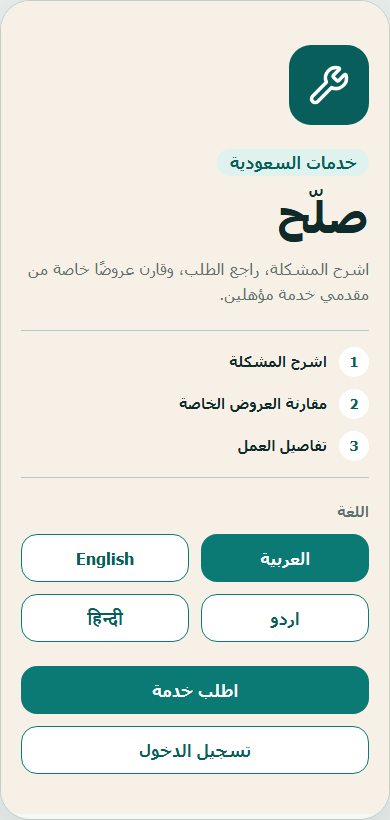
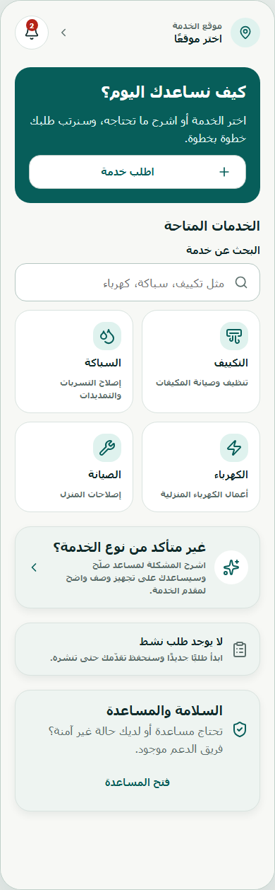
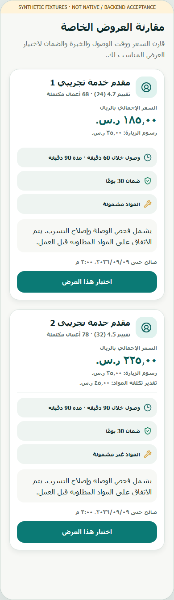

# Professional UI and application reliability candidate

Status: CURRENT SUPPORTING DOCUMENT. Audience: engineering, product and release owners.

This candidate improves the existing Sallah service marketplace and fixes concrete client-side
reliability defects. It starts from canonical main `9440f1b18d8fcd41e75a3b16910cfa458866bb0b`.
The containing commit and matching CI belong in the PR evidence; this file cannot embed its own SHA.

## Resulting behavior

- Welcome explains the service journey and exposes the four language choices. Customer home puts
  service discovery and active work first, with consistent search and recovery states.
  Both guest entry actions open public authentication; a protected home route must not return the
  visitor to the welcome screen. The prior no-op was reproduced on the Android emulator.
- Provider home groups work and account actions. Request briefs show schedule, location area and
  qualification context; original content, attachments and translation provenance remain accessible.
  Safety and qualification notices stay visible when supplementary details are collapsed.
- Offer fields keep their labels while filled. Customer comparison shows the server's total, visit
  fee, optional materials estimate and Riyadh expiry, with a clear unavailable state.
- The public Arabic/English website uses the same visual identity, readable service steps and
  provider information, with responsive navigation and a keyboard skip link.
- Urdu/Hindi journey labels now have explicit translations for 78 previously inherited English
  keys per language. A source-driven test covers 132 shared journey keys and their placeholders.
- Switching accounts destroys the prior account's query cache and component state. Late responses
  cannot populate the next account's cache; same-account token refreshes preserve useful state.
- Provider onboarding restores the owner's existing profile, services, document count, coverage
  and hours. Background refetches preserve edits. Submission stops if its owner changes during upload.
- Notification switches save only their changed field, reject concurrent writes to the same field,
  validate server confirmation and roll back failures. Failed initial reads offer a retry.
- Retrying an offer or change order after a lost response preserves the original generated expiry
  and idempotency payload. Changed business fields still reject the retry.
- Opening a selected request scopes the jobs query to that request; selecting an offer opens its
  returned job and refreshes relevant home/history caches. Long message inboxes scroll.
- Native RTL rows and explicitly aligned fields use one coordinate boundary, so Android does not
  reverse their position twice. This covers shared cards, request and location forms, offers,
  account preferences and trust controls while retaining the locale direction of their containers.
- The selected locale also updates native navigation direction without remounting screens. The
  native back control has a localized accessible name and matching arrow in all four languages.
  The public website has one keyboard skip link owned by the document layout.

## Validation scope

The latest source execution record is retained under ignored `artifacts/professional-ui-rtl-final/`.
Earlier candidate records remain under `artifacts/professional-ui/` and `artifacts/professional-ui-final/`.
Browser rendering
of actual mobile components uses explicit synthetic DOM adapters. It proves only the recorded
browser layout and interactions, not native rendering or authenticated marketplace acceptance.
The website production build is served locally with its existing CSP; it is not a deployment.

Mobile checks passed 440 tests in 64 files; web checks passed 120 tests in 18 files; localization
passed 13 tests. These counts are distinct suites, not a count of repeated executions.
One unchanged media-scanner test is skipped locally because Windows symlink permission is
unavailable. A separate Docker-context export test is skipped because the Docker daemon is unavailable.
Hosted Linux checks must supply their own result. There are no database changes in
this candidate, and no local database reset or hosted migration was performed.

The final local build completed Android and iOS Hermes exports and 47 Next routes. A parallel build
initially exhausted the Windows paging file. Running packages sequentially and limiting Next to
two workers through a process-only launcher resolved that host limitation; repository build and
security settings were preserved. Final validation may reuse those exact-input Turbo build results.

## Visual evidence

The browser review covers 20 welcome/home/provider/auth/account combinations across four languages,
loading/error/empty/active fixtures and doubled text. The separate offer/feed review retains
80 captures across four languages with collapsed/expanded briefs, unavailable offers and form
recovery. These are actual components rendered through synthetic DOM adapters. They do not prove
native keyboard, screen-reader, push delivery, location or authenticated lifecycle behavior.
Long single-line placeholders can scroll or truncate at doubled text; persistent field labels remain
fully visible.

Android Preview26, built from predecessor `2a3dc4700aec5f7564285693d6f73f2b21be53fa`, was installed
and its bytes matched the verified signed APK. Its eight guest entry routes and four-language 2x
text/password/keyboard cases passed, but actual native images exposed the Arabic/Urdu double
reversal and the untranslated native back label. Those failures drove the native RTL corrections
above; Preview26 is baseline evidence, not acceptance of the containing source. A new exact-source
signed APK and native rerun are required after this source freeze.

Representative mobile DOM captures, **not device screenshots**:

| Welcome                                                                             | Customer home                                                                                   | Offer comparison                                                                                      |
| ----------------------------------------------------------------------------------- | ----------------------------------------------------------------------------------------------- | ----------------------------------------------------------------------------------------------------- |
|  |  |  |

[Public website browser capture](../screenshots/professional-ui/public-web-ar.png). Its optimized
local build was checked at 1440, 390 and 320 pixels in Arabic/English, with a keyboard skip link,
200% text and no console errors. Urdu/Hindi policy-route checks retain the legal fail-closed state.

## Candidate gates

| Gate                                                      | Status               | Evidence boundary                                                                                                                                |
| --------------------------------------------------------- | -------------------- | ------------------------------------------------------------------------------------------------------------------------------------------------ |
| Regression tests for repaired behavior                    | PASS                 | Includes reproduced failing account, onboarding, cache, expiry and navigation cases before fixes.                                                |
| Bounded independent source review                         | PASS                 | Reviewed changed client trust boundaries and five redesigned marketplace screens; no actionable finding remained. Not a complete security audit. |
| Dependency licenses and repository security script        | PASS                 | Permissive license policy, secret-pattern scan and dependency audit; no dependency or lockfile changes.                                          |
| Final repository validation                               | PASS                 | `pnpm validate` completed on the source candidate, including format, documentation, boundaries, strict types, units and build outputs.           |
| New signed native candidate                               | NOT RUN              | Not dispatched at source freeze. Subsequent signed-build/emulator evidence belongs in the PR execution record and must identify this commit.     |
| Physical Android, iOS native and screen-reader acceptance | NOT RUN              | Emulator-only work was requested; physical devices and iOS signing are unavailable.                                                              |
| Public production and store approval                      | HUMAN INPUT REQUIRED | See remaining inputs below.                                                                                                                      |

## Remaining release inputs

The owner has not supplied the legal entity, public domain or support email. Production remains
fail-closed until the actual values and reviewed policies are approved. Human localization review,
physical-device acceptance, store ownership/signing and production service/operations approvals
remain required in [HUMAN_INPUTS](../HUMAN_INPUTS.md) and the
[external release gates](../release/EXTERNAL_RELEASE_GATES.md). Synthetic fixtures do not satisfy
these requirements. No policies, credentials, billing, production configuration or provider
verification decisions were created by this UI work.

## Changes and rollback

There are no database migrations, RLS changes, new dependencies or copied third-party assets.
Server authorization, sealed offers, eligibility checks and exact-location restrictions remain
unchanged. Reviewers should exercise account switching with outstanding requests, failed preference
writes, retained onboarding coverage/hours and expiry-preserving command retries.

For rollback, revert the candidate through a reviewed PR and rebuild the prior approved client/web
source. Existing journal entries retain the original complete payload schema. No database rollback
or migration replay is needed. Current runtime/backend/legal gates remain authoritative.
